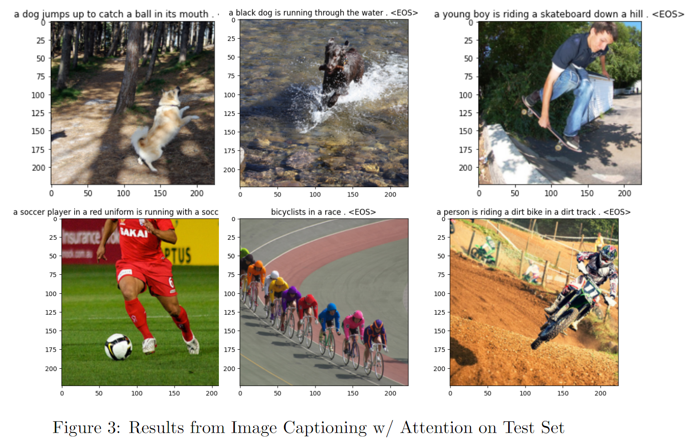

# Image Captioning with RNN/LSTM and Attention Mechanisms

This repository contains the implementation of an image captioning model using Recurrent Neural Networks (RNN), specifically Long Short-Term Memory (LSTM) networks, enhanced with Bahdanau attention mechanisms. The project is detailed in our paper and demonstrates the application of these technologies to generate descriptive captions for images.

## Project Overview

Image captioning involves generating textual descriptions for images automatically. This task has important applications such as aiding visually impaired individuals, improving image retrieval systems, and enhancing human-computer interaction. We utilize an encoder-decoder architecture where the encoder uses a pre-trained CNN to extract features from images, and the decoder employs an RNN with LSTM to generate captions based on these features. The addition of the Bahdanau attention mechanism allows the model to focus on relevant regions of the image during the caption generation process.

### Dataset

We use the Flickr8k dataset, which comprises 8,000 images each paired with five human-annotated captions. This dataset provides a diverse set of images and annotations for training and evaluating our model.

### Model Architecture

- **Encoder**: Utilizes ResNet50 to extract a 2048-dimensional feature vector from input images.
- **Decoder**: An LSTM-based RNN that generates captions from the encoded image features. It incorporates Bahdanau attention to enhance focus on pertinent parts of the image.

### Training and Evaluation

The model is trained using cross-entropy loss with an Adam optimizer. We evaluate the model using the BLEU score, comparing generated captions to ground truth annotations to assess quality.

## Results

Our experiments show that the attention mechanism significantly improves the performance of the image captioning model, allowing it to generate more accurate and contextually relevant captions.

## Contribution

This project is developed by Katie Greed and Mike Keohane. For more details, check out our [paper](https://github.com/kgreed4/Image-Captioning).
